# Karpathy LLM Wiki

<p align="center">
  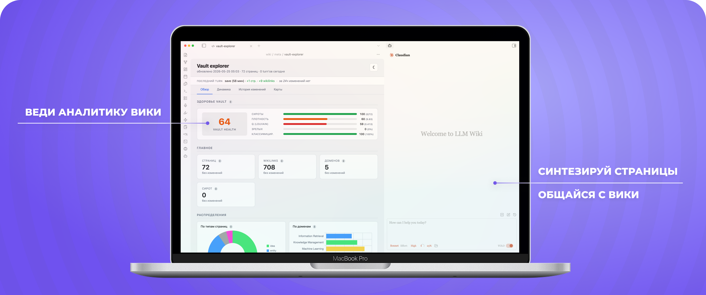
</p>

<p align="center">
  
  
  
  
  
</p>

**Karpathy LLM Wiki** — программная реализация паттерна [LLM Wiki](https://gist.github.com/karpathy/442a6bf555914893e9891c11519de94f), предложенного Андреем Карпаты. Вместо классического RAG, который заново читает сырые документы при каждом запросе, ИИ-агент **однократно компилирует** источники в постоянную wiki из связанных markdown-страниц — и дальше сам её ведёт: создаёт страницы, проставляет перекрёстные ссылки, следит за целостностью. Пользователь работает с готовой базой через привычный Obsidian.

Проект выполнен в рамках выпускной квалификационной работы (СПбГЭТУ «ЛЭТИ», 2026) и доводит концептуальное описание паттерна до практического инструмента.

## Ключевые результаты

- **Агент — менеджер базы, а не ассистент.** Синтез страниц, связывание, аудит целостности и навигационные хабы поддерживаются автоматически; в существующих инструментах (Notion AI, Evernote AI, плагины Obsidian) эта работа остаётся ручной.
- **Экономия контекста в 1,8–13,8×** по входным токенам относительно наивных LLM-альтернатив — за счёт горячего кэша контекста, гибридного поиска с векторной предфильтрацией и детерминированной регенерации артефактов (замеры — в ветке [`benchmarking`](../../tree/benchmarking)).
- **Источники любых форматов**: PDF, DOCX, веб-страницы, аудио, видео, изображения — единый конвейер приведения к markdown.
- **Многослойный аудит базы**: 20 типов проверок в трёх слоях — статические правила, эмбеддинг-аномалии, смысловые LLM-проверки.
- **Полная обратимость**: каждый ход агента фиксируется git-коммитом, данные — локальные markdown-файлы.
- **373 unit-теста** инфраструктурных скриптов (ветка [`tests`](../../tree/tests)).

## Возможности

| Скилл | Команда | Что делает |
| --- | --- | --- |
| **ingest** | `/ingest` | Читает источник из `raw/` или URL, синтезирует связанные страницы wiki |
| **query** | `/query` | Отвечает на вопрос строго по базе с цитированием страниц |
| **study** | `/study` | Учебный диалог на знаниях модели и веб-поиске, с файлированием в wiki |
| **brainstorm** | `/brainstorm` | Модерирует мозговой штурм и склеивает мысль пользователя в permanent note |
| **edge** | `/edge` | Показывает границу базы знаний и подсказывает направления роста |
| **lint** | `/lint` | Трёхслойный аудит целостности с автопочинкой |
| **snapshot** | `/snapshot` | Тяжёлая аналитика: карта знаний (UMAP), граф связей, sankey, treemap, LLM-инсайты |
| **transcribe** | `/transcribe` | Конвертация PDF/DOCX/аудио/видео в markdown-источник |
| **save** | `/save` | Сохраняет ответ или инсайт из чата как страницу wiki |
| **help** | `/help` | Справка по всем скиллам |

Помимо скиллов, после каждого хода агента хуки автоматически обновляют эмбеддинги, мастер-индекс, живой дашборд `vault-explorer.html` и коммитят изменения в git — без расхода токенов.

## Архитектура

Vault устроен как четыре слоя с явным контрактом зон записи: `raw/` — неизменяемые источники, `wiki/` — синтезированное знание, `.claude/` — декларации поведения агента (скиллы, хуки), `bin/` — детерминированные python-скрипты, снимающие с LLM алгоритмические задачи.

Структура wiki реализует гибридный фреймворк организации знаний:

- **иерархия** — `wiki/domains/` как навигационные хабы (map of content);
- **Zettelkasten** — `wiki/ideas/` + `wiki/entities/` с плотными wikilinks;
- **Mind Mapping** — `wiki/minds/` через `/brainstorm`.

```
karpathy-llm-wiki/
├── .claude/         # скиллы и хуки агента (CLAUDE.md, skills/, settings.json)
├── _templates/      # шаблоны страниц: idea / entity / domain / question / mind
├── assets/          # баннер, архитектурные схемы, отчёт ВКР
├── bin/             # инфраструктурные скрипты: эмбеддинги, индекс, lint, дашборд
├── raw/             # per-user источники: md, pdf, транскрипты (gitignored)
├── wiki/            # per-user синтез: ideas, entities, domains, questions, minds (gitignored)
└── ARCHITECTURE.md  # design-doc: контракты слоёв, скиллов, скриптов
```

### Архитектурные схемы

<details>
<summary><b>1. Цикл работы агента</b></summary>
<p align="center">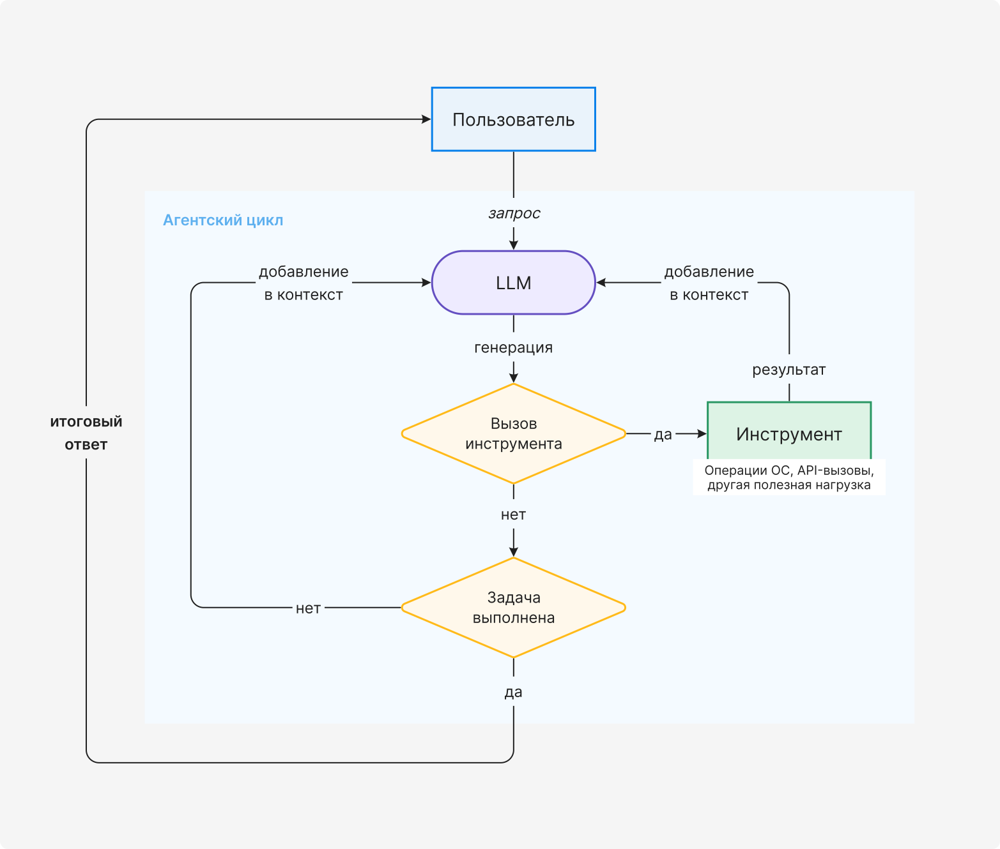</p>
</details>

<details>
<summary><b>2. Опорные операции исходного паттерна LLM Wiki</b></summary>
<p align="center">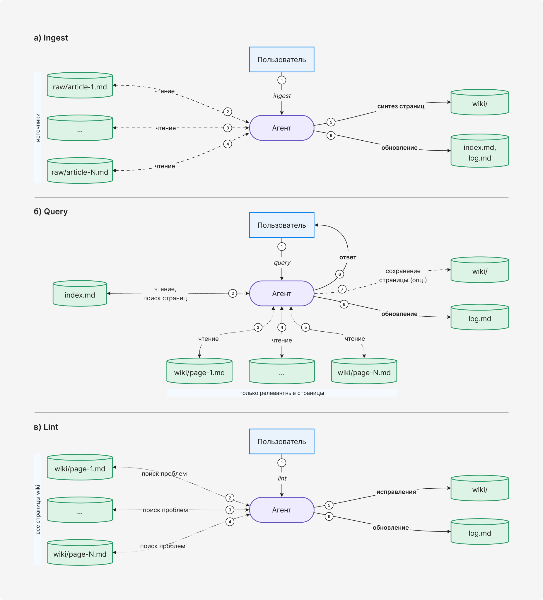</p>
</details>

<details>
<summary><b>3. Четырёхуровневая архитектура vault</b></summary>
<p align="center">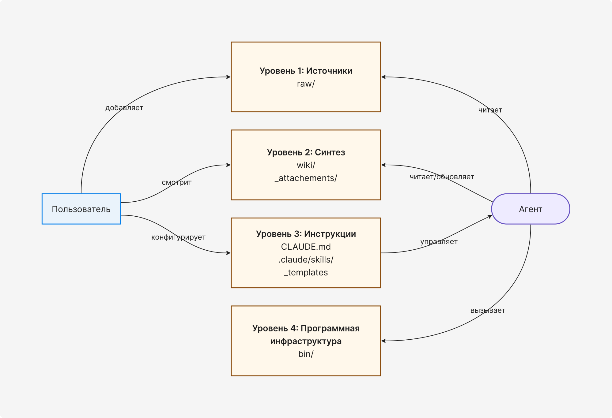</p>
</details>

<details>
<summary><b>4. Жизненный цикл горячего кэша контекста</b></summary>
<p align="center">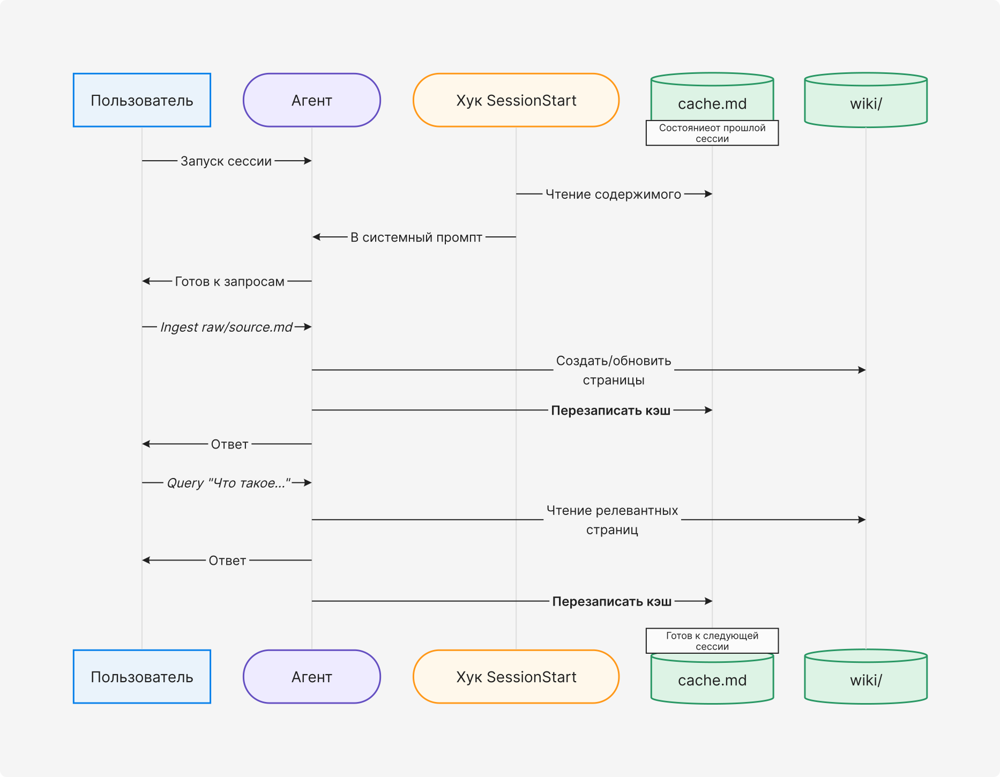</p>
</details>

<details>
<summary><b>5. Гибридный поиск при запросе к базе</b></summary>
<p align="center">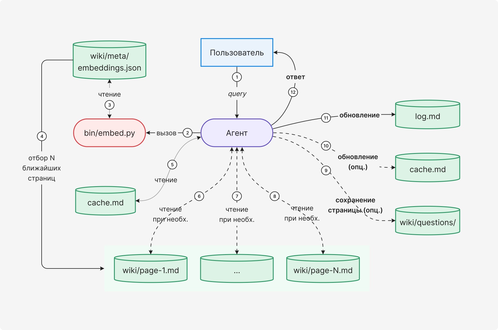</p>
</details>

<details>
<summary><b>6. Детерминированная регенерация производных артефактов</b></summary>
<p align="center">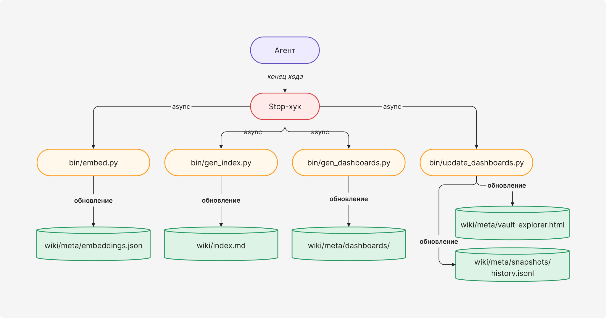</p>
</details>

<details>
<summary><b>7. Унифицированный конвейер ingest для разных форматов</b></summary>
<p align="center">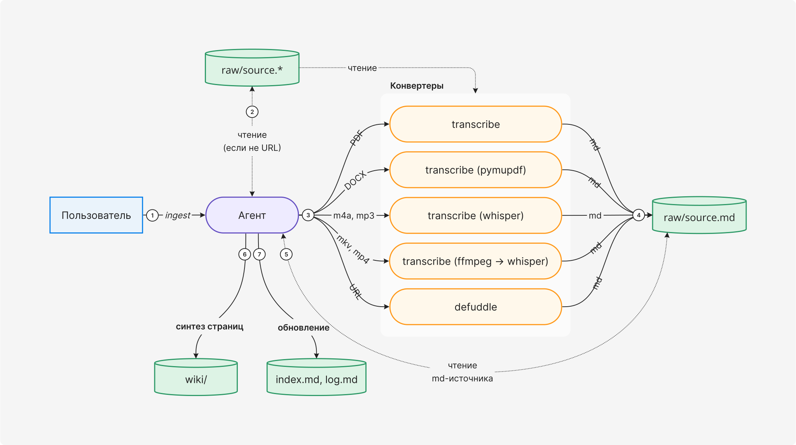</p>
</details>

<details>
<summary><b>8. Цикл фиксации мыслей (brainstorm)</b></summary>
<p align="center">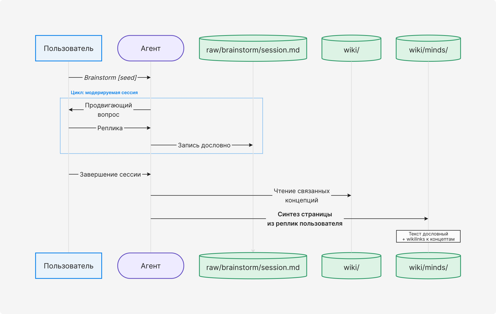</p>
</details>

<details>
<summary><b>9. Двухконтурное обновление дашборда состояния vault</b></summary>
<p align="center">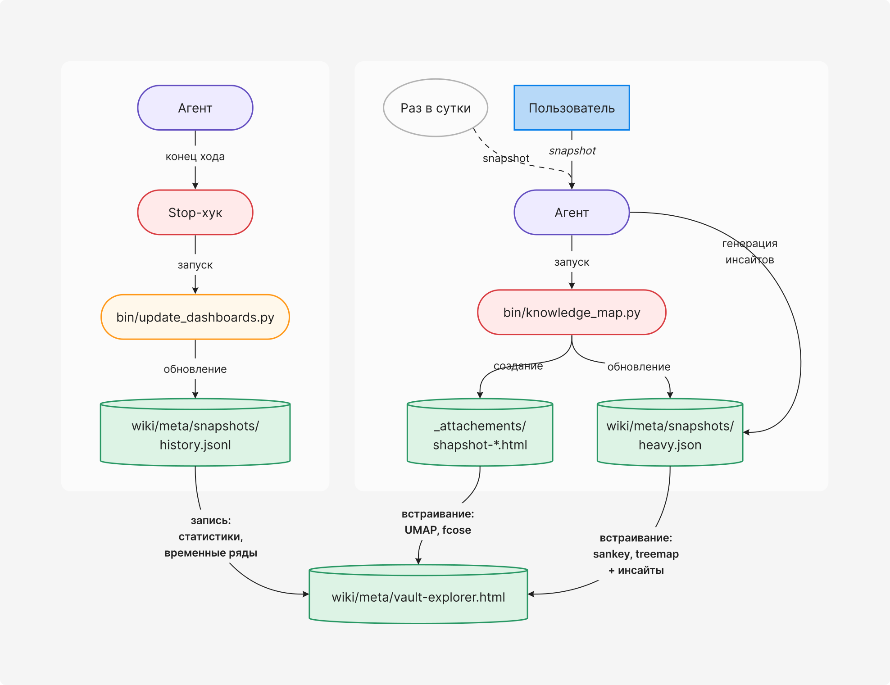</p>
</details>

<details>
<summary><b>10. Трёхслойный аудит целостности базы знаний</b></summary>
<p align="center">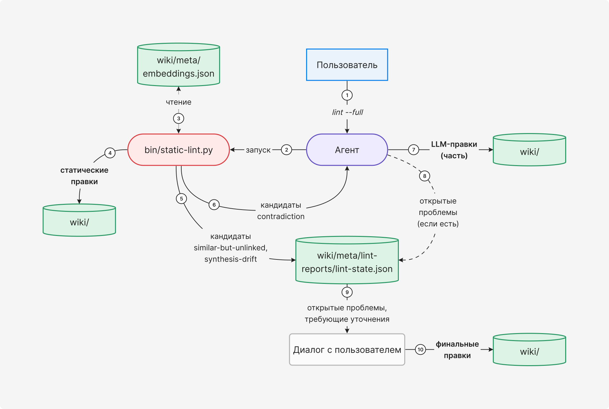</p>
</details>

## Стек технологий

| Компонент | Технология |
| --- | --- |
| Агентская среда | [Claude Code](https://docs.claude.com/en/docs/claude-code/overview) + Claude Opus 4.7 |
| Инфраструктурные скрипты | Python 3.11+ (pymupdf4llm, umap-learn, networkx, tiktoken) |
| Семантический поиск | эмбеддинг-модель qwen3-embedding-8b (Ollama / OpenAI-compatible API) |
| Интерфейс пользователя | Obsidian + плагин [Claudian](https://github.com/YishenTu/claudian) |
| Визуализация | Cytoscape.js, Chart.js (vendored) |
| Конвертация источников | pymupdf, pandoc, whisper-cpp, ffmpeg, [defuddle](https://github.com/kepano/defuddle) |
| Версионирование | Git (auto-commit каждого хода агента) |

## Ветки репозитория

| Ветка | Назначение |
| --- | --- |
| [`main`](../../tree/main) | Основная реализация под Claude Code — готовый к использованию шаблон vault |
| [`tests`](../../tree/tests) | Unit-тесты инфраструктурных скриптов `bin/` (373 теста, pytest) |
| [`benchmarking`](../../tree/benchmarking) | Скрипты и результаты количественных замеров эффективности архитектурных решений |
| [`opencode`](../../tree/opencode) | Экспериментальный порт на открытый CLI-агент [opencode](https://opencode.ai/) |

## Быстрый старт

Требуются [Claude Code](https://docs.claude.com/en/docs/claude-code/overview) и Python 3.11+.

```bash
git clone https://github.com/matvej-melikhov/karpathy-llm-wiki.git && cd karpathy-llm-wiki
bash bin/init.sh         # интерактивный wizard: зависимости, .env, Obsidian, git
claude                   # запустить агента
```

Wizard проводит через установку опциональных компонентов (pandoc, whisper, defuddle, embedding-провайдер), показывает каждую команду перед выполнением и в конце переинициализирует git под ваш remote.

> [!NOTE]
> Для работы агента достаточно подписки Claude Pro — отдельный API-ключ не обязателен. Эмбеддинг-модель можно поднять локально через Ollama: тогда семантический поиск бесплатен, а содержимое базы не покидает вашу машину.

Первая сессия:

```
/ingest raw/test.md     — синтезировать источник в wiki-страницы
/query что такое RLHF?  — спросить по базе
/edge                   — посмотреть фронтир (что стоит углубить)
/lint                   — проверить связность wiki
/snapshot               — собрать дашборд (UMAP, граф, sankey)
/help                   — справка по любому скиллу
```

Wiki совместима с Obsidian — откройте папку как vault (`Manage Vaults → Open folder as vault`).

## Публикации

- **Отчёт ВКР**: «Систематизация знаний с применением средств искусственного интеллекта» — СПбГЭТУ «ЛЭТИ», 2026. [Полный текст (PDF)](./assets/report.pdf) · [Презентация к защите (PDF)](./assets/presentation.pdf)
- **Статья**: Мелихов М.А. Программная реализация паттерна LLM Wiki для систематизации персональных знаний // Студенческий вестник: электрон. научн. журн. 2026. № 22(402). URL: <https://www.internauka.org/journal/stud/herald/402>
- **Исходная идея паттерна**: Andrej Karpathy, [LLM Wiki (gist)](https://gist.github.com/karpathy/442a6bf555914893e9891c11519de94f)

## Лицензия

[MIT](./LICENSE)
